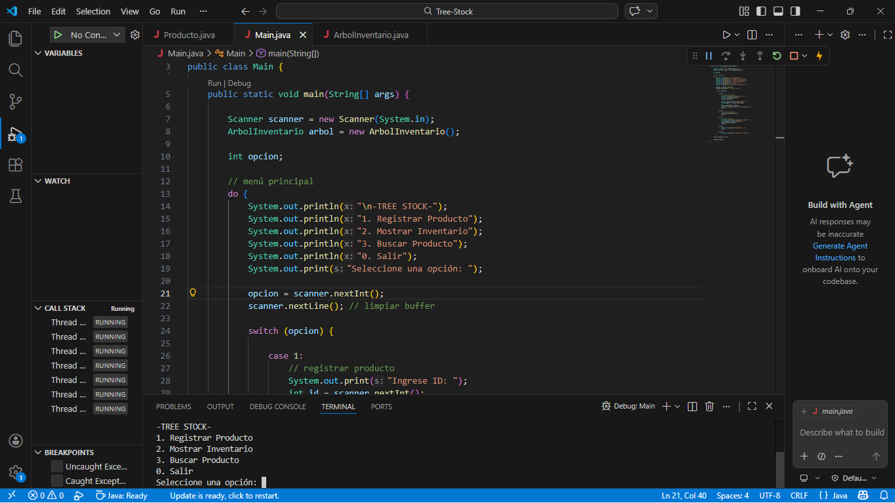
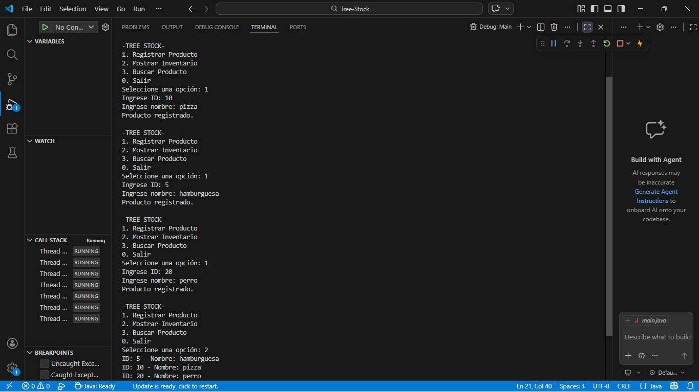
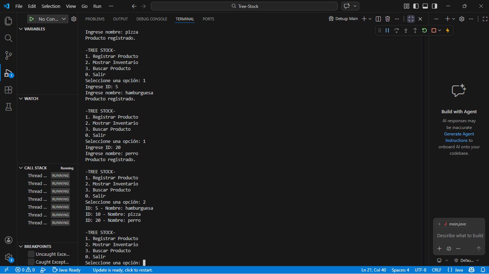
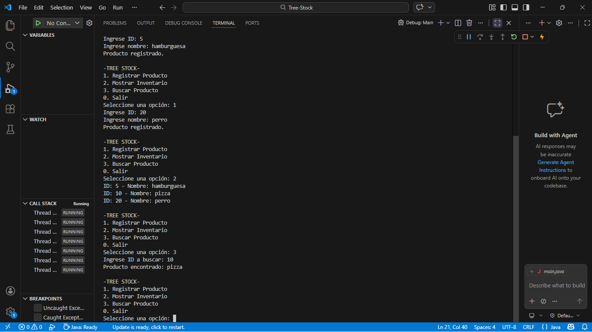

# Tree-Stock - Sistema de Inventario con Árbol Binario de Búsqueda

## Objetivo

Desarrollar una aplicación en Java que implemente un árbol binario de búsqueda (ABB) para gestionar un inventario de productos, permitiendo registrar, mostrar y buscar productos mediante el uso de estructuras dinámicas y recursividad.

## ¿Qué es un Árbol Binario de Búsqueda?

Un árbol binario de búsqueda es una estructura de datos donde cada nodo tiene máximo dos hijos:

- Los valores menores se ubican a la izquierda
- Los valores mayores se ubican a la derecha

Esto permite organizar los datos de forma eficiente.

## 🔁 Recursividad en el proyecto

La recursividad se usa para:

- Insertar productos en el árbol
- Recorrer el árbol (inorden)
- Buscar productos

O sea, un método se llama a sí mismo para recorrer los nodos hasta encontrar la posición correcta.

## Funcionalidades

El sistema permite:

1. Registrar productos (ID y nombre)
2. Mostrar el inventario ordenado (recorrido inorden)
3. Buscar un producto por su ID

## Ejecución del programa

1. Ejecutar la clase `Main.java`
2. Usar el menú interactivo:
   - Opción 1: Registrar producto
   - Opción 2: Mostrar inventario
   - Opción 3: Buscar producto

## Capturas de pantalla

### Menú

### Registro de productos

### Inventario ordenado

### Búsqueda de producto

## Video de sustentación

## Autor

Trabajo realizado por el estudiante Jhanney Antonio Cuadros Ramos como parte de la actividad de Árboles en Java.

## Proyecto realizado en Java con estructura de arbol binario de busqueda.
